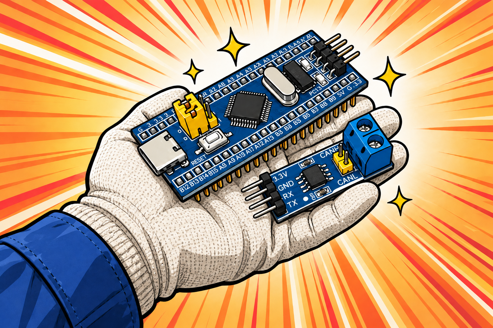

# UART-CAN Bridge

[](https://github.com/waibibabowaibiwaibi/stm32f103c6t6_candevice/actions/workflows/ci.yml)

一个基于 STM32F103C6T6 的开源 UART ↔ CAN 转换器，包含设备固件、Windows / Linux 图形上位机和开放的文本协议。

> “卧槽张哥，你把 CAN 盒拿走了，那我呢？”
>
> 
>
> “太好了，是f103，我们有救了！”


> [!IMPORTANT]
> 当前已发布版本为 **v0.1.0-beta**。`main` 的软件自动检查和计划硬件验收均已通过，包括全部支持的 CAN 波特率、双向帧传输、长时间运行和 bus-off 恢复；尚未发布的改动将在下一版本提供。本项目仅用于学习和实验室调试，不适用于安全关键控制；使用者需自行评估连接、数据与操作风险。

## 它能做什么

- 将串口文本命令转换为经典 CAN 2.0 标准帧、扩展帧和远程帧
- 将收到的 CAN 帧实时转发到串口
- 在 Windows / Linux 上查看、过滤、批量/周期发送并导出 CAN 报文
- 发送任务支持每批帧数、间隔、发送次数，以及 CAN ID/数据逐帧递增
- 查询接收、发送、丢帧、串口错误和 bus-off 恢复计数
- PC13 作为非阻塞收发活动指示灯，高流量时自然保持点亮
- 从上位机切换 CAN 波特率：10 / 20 / 50 / 100 / 125 / 250 / 500 / 800 / 1000 kbit/s
- CAN bus-off 自动恢复，UART 接收具备溢出恢复与队列缓冲
- 固件支持 EIDE、Keil MDK-ARM、CMake + ATfE/Clang 和 CMake + GCC

上电默认参数：CAN `500 kbit/s`，USART1 `921600 8N1`，经典 CAN 单帧最多 `8` 字节。CAN 波特率运行时可改，复位后恢复为 500 kbit/s。

## 开始使用

### 你需要准备

- STM32F103C6T6 最小系统，使用 8 MHz 外部晶振
- 一个经典高速 CAN 收发器或收发器模块（本项目实测使用 SN65HVD230）
- 一个 3.3 V USB-UART 转换器和数据线
- ST-Link/CMSIS-DAP 等 SWD 下载器
- 至少另一个与所选波特率一致、能够 ACK 的 CAN 节点
- 位于总线两端的两个 120 Ω 终端电阻

> [!CAUTION]
> PA11/PA12 是 MCU 逻辑信号，**不能直接连接 CANH/CANL**。必须经过 CAN 收发器，并按照收发器数据手册供电。不要默认所有 5 V CAN 模块的 RXD/TXD 都可安全连接 3.3 V MCU。

SN65HVD230 只是本项目作者实测的型号，不是硬性依赖。其他符合 ISO 11898-2 的经典高速 CAN 收发器/模块通常也能使用，但要逐项确认 MCU 侧逻辑电平、供电电压、待机/使能引脚、最高波特率，以及模块是否已经自带 120 Ω 终端电阻。CAN FD 收发器可以承载经典 CAN 电气信号，但本固件和 STM32F103 的 bxCAN **不支持 CAN FD 帧**。

### 接线

USB-UART 与 MCU 需要交叉连接，并共地：

| USB-UART | STM32F103 | 说明 |
|---|---|---|
| TXD | PA10 / USART1_RX | 适配器发送到 MCU |
| RXD | PA9 / USART1_TX | MCU 发送到适配器 |
| GND | GND | 必须共地 |

MCU 与 CAN 收发器的典型连接：

| STM32F103 | CAN 收发器 | 说明 |
|---|---|---|
| PA12 / CAN_TX | TXD | MCU 发送逻辑信号 |
| PA11 / CAN_RX | RXD | MCU 接收逻辑信号 |
| GND | GND | 必须共地 |
| — | CANH / CANL | 接入实际 CAN 总线 |

完整步骤、烧录地址和首帧测试见 [五分钟快速开始](docs/QUICK_START.md)。

### 下载与运行

在 [Releases 页面](../../releases/latest)下载当前已发布版本：

- `UART-CAN-Host-<version>-windows-x64.exe`：Windows 上位机
- `UART-CAN-Host-<version>-linux-x64.tar.gz`：Linux x64 上位机压缩包（将从下一版本开始随 Release 提供）
- `UART-CAN-Host-<version>-linux-x64.tar.gz.sha256`：Linux 压缩包校验文件（将从下一版本开始随 Release 提供）
- `c6t6-<version>.hex`：推荐烧录文件
- `c6t6-<version>.bin`：从 `0x08000000` 烧录
- `SHA256SUMS.txt`：Windows 上位机、固件和许可证文件的完整性校验
- `LICENSE.txt`、`THIRD_PARTY_NOTICES.md` 和厂商许可证：随二进制保留的授权材料

需要使用尚未发布的新功能时，也可以从源码运行上位机：

```powershell
cd host_app
python -m venv .venv
.\.venv\Scripts\python.exe -m pip install -r requirements.txt
.\.venv\Scripts\python.exe main.py
```

Linux 源码运行：

```bash
cd host_app
python3 -m venv .venv
.venv/bin/python -m pip install -r requirements.txt
.venv/bin/python main.py
```

Linux 打包运行库、串口权限与构建方法见 [上位机说明](host_app/README.md)。Linux 构建命令为 `bash host_app/build_linux.sh`，输出 `host_app/dist/UART-CAN-Host-linux-x64.tar.gz`；解压后运行 `./UART-CAN-Host`。CI 会将 Windows / Linux 构建上传为 Actions artifacts。

选择 USB-UART 对应的 COM 口或 `/dev/ttyUSB*`、`/dev/ttyACM*` 设备，UART 波特率保持 `921600`，点击“连接”。状态计数器能正常刷新，说明串口链路已经建立。需要更改总线速率时，在第二行选择 CAN 波特率并点击“应用 CAN 波特率”。

## 工作原理


串口协议是 SLCAN 风格的 ASCII 文本协议，但不是完整 Lawicel SLCAN 实现。例如，发送标准数据帧 `0x123`：

```text
t12381122334455667788\r
```

设备收到 CAN 帧后使用相同格式回传。协议格式和状态计数器详见 [协议说明](docs/PROTOCOL.md)。

## 上位机功能

- 自动扫描 Windows COM 口和 Linux 串口设备
- 查询并设置设备 CAN 波特率
- 亮色 / 暗色主题，默认跟随系统，可手动选择并保存
- 标准帧/扩展帧、数据帧/远程帧显示
- 按 CAN ID、方向和帧类型过滤
- 任务式发送：每次 1～100 帧、1～3,600,000 ms 间隔、1～1,000,000 次；第一批立即发送
- CAN ID 和数据可按帧递增并在上限后回绕；可随时点击“停止”结束任务
- 每秒读取固件运行计数器
- 导出 UTF-8 CSV，内存中最多保留最近 20,000 帧

上位机显示的 `TX` 只表示命令已加入本机串口发送队列，**不表示单片机已接收，也不表示 CAN 总线上的其他节点已经 ACK**。

## 构建与测试

### 跨平台 CMake 固件构建

Linux / CI 推荐安装 CMake、Ninja 和 `arm-none-eabi-gcc`，并确保工具位于 `PATH`：

```bash
cmake --preset gcc-Release
cmake --build --preset gcc-Release
```

Windows 使用 `CMakeUserPresets.json` 保存本机 ATfE、GNU Arm 和 Ninja 路径；VS Code 中只显示“开发调试 (Debug)”和“正式发布 (Release)”两项，输出分别位于 `build/Debug/` 和 `build/Release/`。本机预设模板见[故障排查](docs/TROUBLESHOOTING.md#cmake-找不到工具链)。Linux GCC 输出位于 `build/gcc-Release/`。ATfE/Clang、EIDE、Keil MDK-ARM 和独立验证脚本的详细配置见[固件开发说明](README_Converter.md)。

### 测试

```powershell
# 固件纯逻辑单元测试
powershell -NoProfile -ExecutionPolicy Bypass -File tools/run-host-tests.ps1

# 上位机协议与表格模型测试
cd host_app
.\.venv\Scripts\python.exe -m unittest discover -s tests -v
```

GitHub Actions 会重复执行 GCC 固件构建、自动测试，以及 Windows / Linux 上位机打包。

## 已知限制

- 仅支持经典 CAN 2.0，**不支持 CAN FD**
- STM32F103 的片上 USB 与 bxCAN 共用专用 SRAM，不能同时工作，因此当前硬件不能仅靠固件变成 PCAN、`gs_usb` 或其他板载 USB-CAN 设备；实板排查过程见[板载 USB-CAN 实验报告](docs/USB_CAN_LIMITATION.md)
- CAN 波特率修改只在本次运行中生效，设备复位后恢复为 500 kbit/s
- 设备协议没有发送 ACK；上位机不能确认报文是否真正出现在总线上
- 没有时间戳同步，界面时间是上位机收到串口数据的时间
- 固件使用普通 CAN 模式，测试发送时总线上需要另一个能够 ACK 的正常节点
- 文本协议有编码开销，即使 UART 为 `921600`，高负载 CAN 总线的峰值流量仍可能导致 `UART 丢弃`，上位机不适合作为无损高带宽采集器

遇到无法连接、收不到帧、bus-off 或 EIDE 构建问题，请看 [故障排查](docs/TROUBLESHOOTING.md)。

## 仓库结构

| 路径 | 内容 |
|---|---|
| `Core/` | STM32 固件与 UART-CAN 核心逻辑 |
| `Drivers/` | 构建所需的 STM32 HAL 与精简 CMSIS 文件 |
| `MDK-ARM/` | Keil MDK-ARM / µVision 工程 |
| `host_app/` | PySide6 Windows / Linux 上位机与测试 |
| `tools/` | 固件测试、独立验证和 Release 打包脚本 |
| `docs/` | 快速开始、协议、排障和发布检查表 |
| `.github/` | CI 和问题反馈模板 |

## 参与贡献

欢迎提交 Issue 和 Pull Request。复现步骤、测试要求与提交约定见 [CONTRIBUTING.md](CONTRIBUTING.md)。发布过程见 [Release 检查表](docs/RELEASE_CHECKLIST.md)。

## 许可证

项目自有代码以 [MIT License](LICENSE) 发布。STM32 HAL、CMSIS 等第三方组件继续适用各自许可证，详情见 [THIRD_PARTY_NOTICES.md](THIRD_PARTY_NOTICES.md)。
