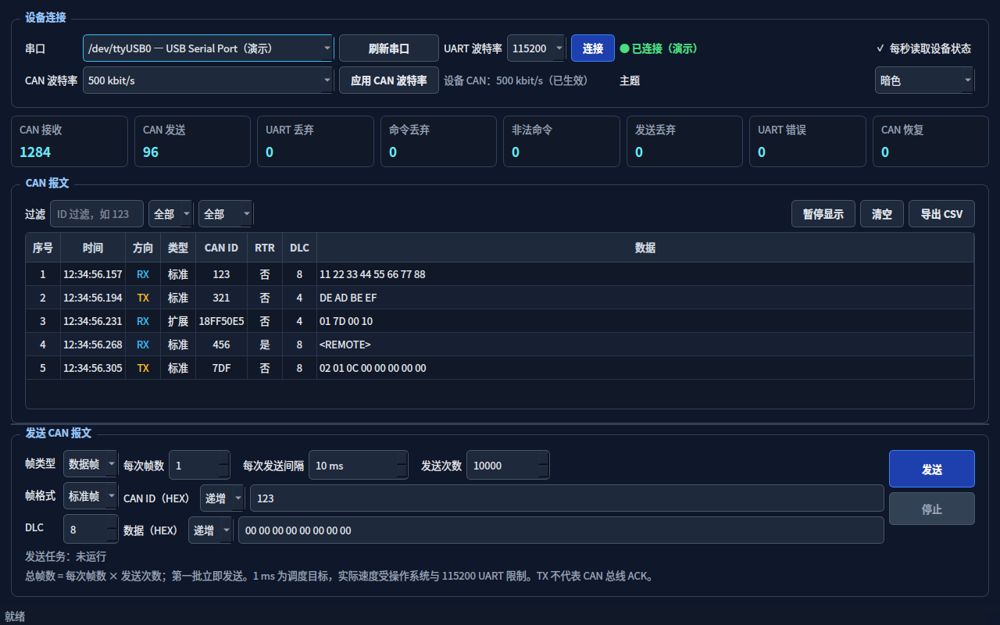
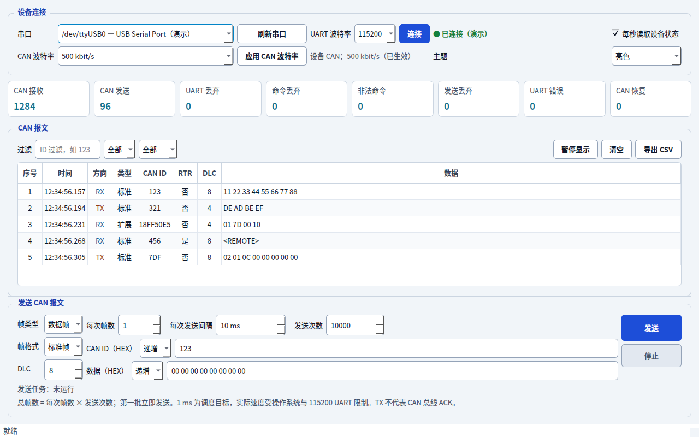

# UART-CAN 上位机

适用于本仓库 STM32F103 UART-CAN 固件的 Windows / Linux 桌面工具。



第一次接线和烧录请从仓库根目录的[五分钟快速开始](../docs/QUICK_START.md)开始。

## 功能

- 扫描并连接 Windows COM 串口或 Linux `/dev/ttyUSB*`、`/dev/ttyACM*` 设备（固件默认 `921600 8N1`）
- 查询并切换设备 CAN 波特率（10 kbit/s～1 Mbit/s 的 9 个常用档位）
- 实时显示标准帧、扩展帧、数据帧和远程帧
- 按 CAN ID、收发方向和帧类型过滤
- 任务式发送 CAN 报文：可设置每次帧数、每次间隔和发送次数，第一批立即发送
- 可选 CAN ID 每帧 `+1`，以及数据整体按大端整数每帧 `+1`，并可随时停止
- 每秒读取固件 `V` 状态计数器
- 将当前过滤结果导出为 UTF-8 CSV
- 最多保留最近 20,000 条报文
- 亮色 / 暗色主题，默认跟随系统亮暗并在运行中即时切换，也可手动选择并保存偏好

“每次帧数”是一批中连续写入的帧数，“发送次数”是批次数，因此总帧数 = 每次帧数 × 发送次数。只发一帧时把两者都设为 `1`；周期发送时将“发送次数”设为期望值。

递增在每帧成功加入串口队列后生效。标准 ID 在 `0x7FF` 后回到 `0`，扩展 ID 在 `0x1FFFFFFF` 后回到 `0`；数据保持当前 DLC 宽度，例如 `00 FF → 01 00`，全 `FF` 后回到全 `00`。远程帧不递增数据。`1 ms` 是操作系统定时调度目标，最大实际速度仍受操作系统和 UART 带宽限制。

## 源码运行

### Windows

```powershell
cd host_app
python -m venv .venv
.\.venv\Scripts\python.exe -m pip install -r requirements.txt
.\.venv\Scripts\python.exe main.py
```

### Linux

需要 Python 3.10 或更新版本。Ubuntu / Debian 安装运行库与中文字体：

```bash
sudo apt-get install python3-venv libegl1 libopengl0 libxcb-cursor0 libxkbcommon-x11-0 fonts-noto-cjk
cd host_app
python3 -m venv .venv
.venv/bin/python -m pip install -r requirements.txt
.venv/bin/python main.py
```

### Linux 串口权限

插入 USB-UART 后点击“刷新串口”，选择 `/dev/ttyUSB0` 或 `/dev/ttyACM0` 等对应设备。应用使用 USB-UART 文本协议，不需要 SocketCAN 接口。

如果连接时提示 `Permission denied`，先用 `ls -l /dev/ttyUSB0` 查看设备所属组。Ubuntu / Debian 通常是 `dialout`：

```bash
sudo usermod -aG dialout "$USER"
```

退出桌面会话并重新登录后生效。其他发行版可能使用 `uucp`，以设备实际所属组为准。串口被其他程序占用时，先关闭那个程序。

## 主题

“设备连接”区域右侧的“主题”提供 **跟随系统 / 亮色 / 暗色**。默认跟随系统；Windows 和提供外观偏好的 Linux 桌面会在系统亮暗变化时即时切换，不中断串口连接或发送任务。手动选择会保存到本机设置，重启后保留。

系统外观由 [Qt QStyleHints](https://doc.qt.io/qt-6/qstylehints.html#colorScheme-prop) 提供。Linux GNOME / KDE 桌面需正常提供主题设置（GNOME 通常通过 `xdg-desktop-portal` 及对应桌面后端）。没有可用的系统偏好时使用亮色，仍可手动切换。



## 构建 Windows EXE

```powershell
.\host_app\build_exe.ps1
```

生成文件：`host_app/dist/UART-CAN-Host.exe`。

发布版本应运行 `tools/package-release.ps1`，由脚本重命名 EXE、配套固件并生成 SHA-256 校验文件。不要将 `dist/` 直接提交到 Git。

## 构建与运行 Linux 版本

在 Linux 本机运行（可用 `PYTHON=python3.12` 指定创建虚拟环境的 Python）：

```bash
bash host_app/build_linux.sh
```

脚本使用与 Windows 相同的固定依赖和 PyInstaller spec，构建后自动运行无界面 smoke test。生成：

- `host_app/dist/UART-CAN-Host`：包含 Python、PySide6 和 pyserial 的单文件可执行程序
- `host_app/dist/UART-CAN-Host-linux-x64.tar.gz`：包含程序、说明和许可证；ARM64 本机构建使用 `linux-arm64` 后缀
- 同名 `.tar.gz.sha256`：SHA-256 校验文件

下载压缩包和校验文件后，在它们所在的目录执行：

```bash
sha256sum -c UART-CAN-Host-linux-x64.tar.gz.sha256
tar -xzf UART-CAN-Host-linux-x64.tar.gz
cd UART-CAN-Host-linux-x64
./UART-CAN-Host
```

压缩包保留执行权限。如果只拷贝单个程序，可先执行 `chmod +x UART-CAN-Host`。运行二进制不需要安装 Python，仍需图形桌面、上文列出的系统运行库与串口权限。

PyInstaller 必须在目标操作系统和架构上构建。CI 的 Linux x64 构建使用 Ubuntu 22.04；本地包的兼容范围取决于构建机的 glibc。应在希望支持的最老发行版上构建，以便在更新的系统运行，详见 [PyInstaller Linux 兼容说明](https://pyinstaller.org/en/stable/usage.html#making-gnu-linux-apps-forward-compatible)。构建产物在 `dist/`，不要提交到 Git。

## 测试

Linux：

```bash
cd host_app
QT_QPA_PLATFORM=offscreen .venv/bin/python -m unittest discover -s tests -v
.venv/bin/python main.py --smoke-test
```

Windows 使用 `.venv\Scripts\python.exe` 执行同样的命令。测试包含协议、表格过滤、发送任务、系统亮暗切换、偏好保存，以及 Linux 伪终端上的串口读写。CI 同时构建 Windows EXE 和 Linux 压缩包并上传为 Actions artifacts。

## 串口协议

应用使用固件现有的 SLCAN-like 文本协议，每条命令以 `\r` 结束：

- 标准数据帧：`tIIILDD...`
- 扩展数据帧：`TIIIIIIIILDD...`
- 远程帧：`r` / `R`
- 状态查询：`V`
- CAN 波特率查询：`S?`
- CAN 波特率设置：`S0`～`S8`

CAN 上电默认为 500 kbit/s，运行时可从界面修改；设备复位后恢复默认值。UART 固定为 921600 baud。上位机默认选择 921600；若之前保存过其他串口波特率，需手动选择 921600 后连接。
